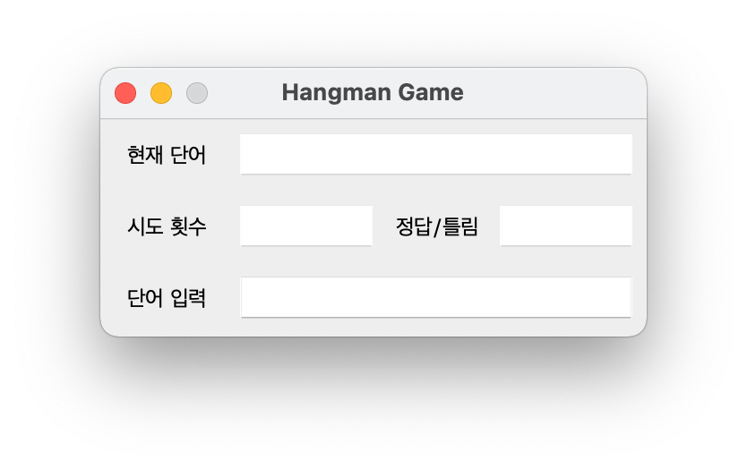

# HangMam Game

### 과제 명세서 

- 행맨(HangMan Game) 게임을 만든다. 게임 규칙은 다음과 같다.
- 규칙 1 : 영어 단어가 적혀 있는 words.txt 파일을 읽고, 영어 단어 하나를 화면에 표시한다.
- 규칙 2 : 이때 화면에 나타난 영어단어의 몇개 글자를 숨긴 다음(ex: apple --> a-ple), 화면에 출력하여 사용자가 단어를 맞추게 하는 게임이다.
- 규칙 3: 숨김 글자의 수는 random 기능을 이용하여 전체 단어의 갯수의 30%가 넘지 않도록한다.
- 규칙 4: 한 단어에 대해 5번 틀리면 새로운 단어를 보여준다.
- 규칙 5: 게임 종료의 조건은 10문항을 맞추거나, 3번 문제를 틀리면 게임을 종료한다.
- 규칙 6: GUI 프로그램으로 개발한다.
- 규칙 7: 2글자 이하의 단어는 제외한다.
- words.txt 파일은 공지 게시판에 올라온 파일을 이용한다.

### 게임 기본 틀

</img>

### 게임 진행

</img>  
</img>  
</img>  
</img>
